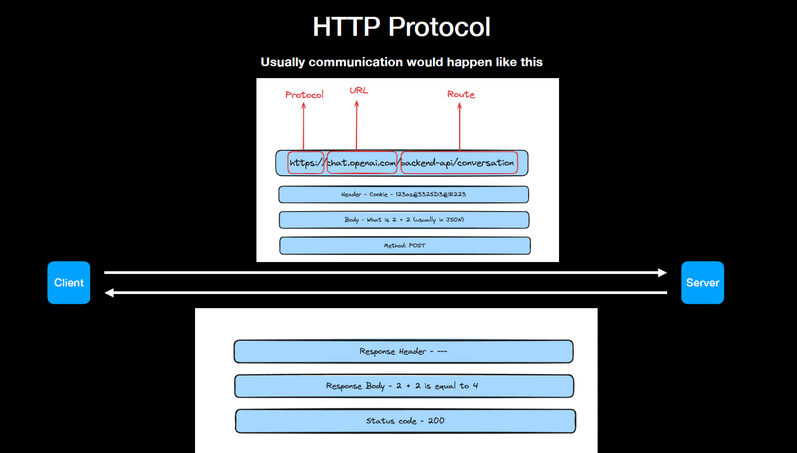

# Node.js

- Let's focus on Node.js. Specifically, how to write Backend applications using JavaScript.

## What can we do with Node.js?

1. Create CLIs
2. Create a video player
3. Create a game
4. Create an HTTP Server

### What's an HTTP server?

- HTTP means Hyper text transfer Protocol.
- A protocol that is defined for machines to communicate. Specifically for websites, it is the most common way for website’s frontend to talk to its backend.

  **First lets understand what are Frontends and Backends.**

  - Frontend/Clients (HTML/CSS/JS). Suppose it's in India.
  - Backends (Node.js). This code is deployed in USA server.

How do frontends talk to backends - Wires/routers.

Some code that follows the HTTP Protocol and is able to communicate with clients (browsers/mobile apps…).

In the end, its the client throwing some information at a server.
Server doing something with that information.
Server responding back with the final result.

### Think of them as functions, where-

1. Arguments are something the client sends.
2. Rather than calling a function using its name, the client uses a URL.
3. Rather than the function body, the server does something with the request.
4. Rather than the function returning a value, the server responds with some data.

### Things client needs to worry about

- Protocol (http/https)
- Address (URL/IP/PORT)
- Route
- Headers, Body, Query Params
- Method

### Things server needs to worry about

- Response headers
- Response body
- Status codes

### Things that happen in your browser after you fire this request (we will get to how to fire request to a backend server later)

1. Browser parses the URL.
2. Does a DNS Lookup (converts google.com to an IP).
3. Establishes a connection to the IP (does handshake…).s

   **What is DNS resolution**

   - URLs are just like contacts in your phone.
   - In the end, they map to an IP.
   - If you ever buy a URL of your own, you will need to point it sto the IP of your server.

### Things that happen on your server after the request is received

1. You get the inputs (route, body, headers).
2. You do some logic on the input, calculate the output.
3. You return the output body, headers and status code.
